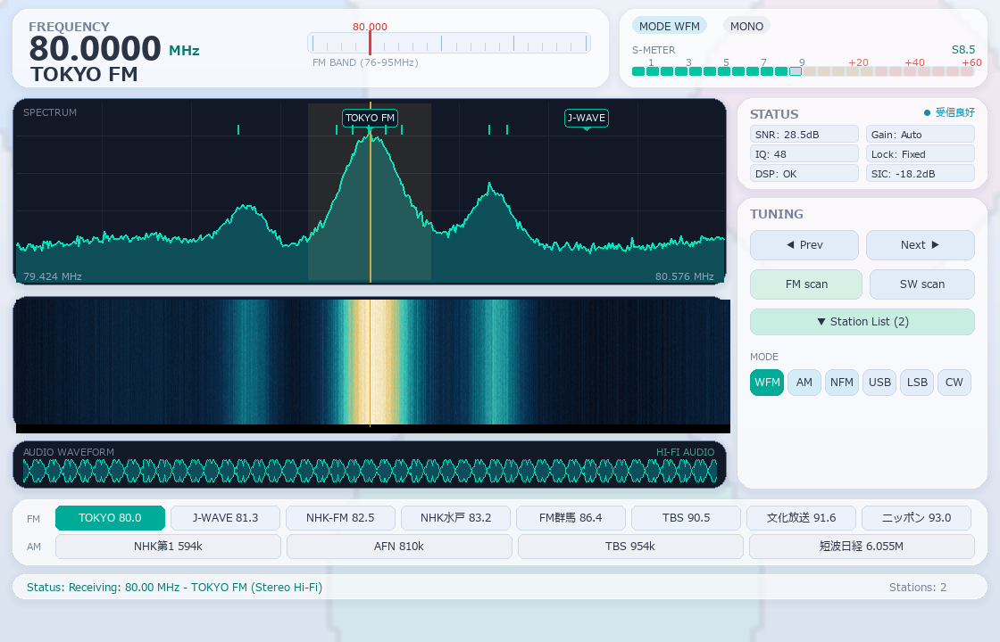

# KomorebiSDR
### A clean, lightweight, and zero-configuration radio receiver for RTL-SDR.
*Named after "Komorebi" (木漏れ日) — the gentle sunlight filtering through trees.*



**KomorebiSDR** is a modern, plug-and-play Software Defined Radio (SDR) receiver designed for calm and effortless everyday listening. 

No complex radio jargon, no messy setup, and no DSP degree required. Just plug in your RTL-SDR USB dongle, launch the app, and enjoy high-fidelity radio broadcasts right from your computer.

---

## Why KomorebiSDR?

- **Plug & Play Radio**: Automatically detects your country, FM grid, and optimal tuner settings. Just turn it on.
- **Modern Frosted-Glass Interface**: Clean, distraction-free spectrum analyzer and responsive waterfall display.
- **Pure & Clear Audio**: Crystal-clear FM stereo with automatic noise suppression and smart loudness leveling.
- **Listen to Everything**: Seamlessly switch between local **FM**, **AM** news, international **Shortwave (SW)** broadcasts, airband, and amateur radio (**SSB / CW**).
- **One-Click Station Discovery**: Built-in smart scanner finds active broadcasts and saves them to your presets instantly.
- **Built-in PC Noise Filter**: Proprietary digital filter automatically cancels out annoying computer buzz and USB clock noise.
- **Fast & Lightweight**: Runs smoothly with minimal CPU usage, built purely on Python and NumPy.

---

## Quick Start

### 1. Prerequisites
- **RTL-SDR USB dongle** (v3, v4, or generic RTL2832U compatible)
- **Windows 10 / 11** with the WinUSB driver installed (via [Zadig](https://zadig.akeo.ie/))
- **Python 3.10+**

### 2. Setup & Run

```bash
# 1. Clone the repository
git clone https://github.com/ootake0914-dotcom/KomorebiSDR.git
cd KomorebiSDR

# 2. Install dependencies
pip install -r requirements.txt

# 3. Start the radio
python main.py
```

*That's it! The radio will open and automatically start playing.*

---

## Prebuilt Executable

You can also run KomorebiSDR directly without installing Python:

1. Build or download the prebuilt binary from the Releases page (`KomorebiSDR.exe`).
2. Run `build_exe.bat` to package your own standalone executable locally via PyInstaller.

---

## Intuitive Controls

| Action | How to do it |
|:---|:---|
| **Tune to a frequency** | Click or drag directly on the spectrum display |
| **Fine-tune** | Use your mouse scroll wheel over the frequency numbers |
| **Discover stations** | Click **Auto Seek** to find and store clear channels |
| **Quick presets** | Click any preset button (**1 – 6**) to jump to your favorite stations |
| **Change modes** | Click **WFM**, **AM**, **NFM**, or **SSB** to switch instantly |

---

## Helpful Keyboard Shortcuts

- `Up` / `Down` Arrow: Step frequency up / down
- `PageUp` / `PageDown`: Fast frequency jump
- `M`: Toggle Mute / Unmute
- `S`: Auto-seek the next active station
- `Space`: Pause / Resume audio playback

---

## Command Line Options (Optional)

You can launch directly to your favorite station or mode from your terminal:

```bash
# Tune directly to a specific station (e.g. 80.0 MHz FM)
python main.py --freq 80.0 --mode WFM

# Start in English interface mode
python main.py --lang en

# Listen to AM Shortwave broadcast (e.g. 9.75 MHz)
python main.py --freq 9.75 --mode AM
```

---

## License

This project is licensed under the [GNU General Public License v2.0 (GPL-2.0)](LICENSE) due to the inclusion of `librtlsdr`. See [THIRD_PARTY_NOTICES.md](THIRD_PARTY_NOTICES.md) for details on bundled third-party components.
